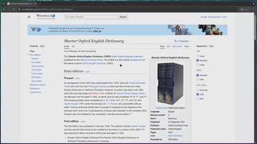
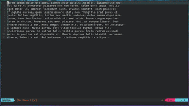
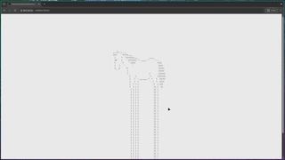

# keyboardMouse

> Use the keyboard to do mouse things

A project inspired by:

- [KeyNav](https://youtu.be/Uot3Cs9YwOA?si=AsGqJGUqo0MNpQzo)
- [mouseless](https://youtu.be/J0rwQVNQkHM?si=v2O7zazIbpw5QAaJ)
- [neverclick](https://www.youtube.com/watch?v=7fGB-hjc2Gc&t=2h00m55s)
- [vimium](https://vimium.github.io/)

## Basic demo









# Limitations and other important notes

## Disclaimer
This software is provided "as is", without warranty of any kind.

## Single-monitor Single-user (ideally a laptop setup)
as of Sunday, January 25, 2026, 00:32:31, AbsolutePointer struggles to do anything useful once a second monitor is plugged in, thus this is a single monitor setup only application

Only works in single user mode. Having any other users logged in and clogging the `/run/user/` directory will break the daemon as of Sunday, January 25, 2026, 15:39:46

## Wayland unstable protocols
This project was built upon ***unstable*** Wayland protocols that not every Wayland compositor supports, specifically:

- [wlr-layer-shell-unstable-v1](https://wayland.app/protocols/wlr-layer-shell-unstable-v1), see [supported compositors for this protocol](https://wayland.app/protocols/wlr-layer-shell-unstable-v1#compositor-support)
- [wlr-screencopy-unstable-v1](https://wayland.app/protocols/wlr-screencopy-unstable-v1), see [supported compositors for this protocol](https://wayland.app/protocols/wlr-screencopy-unstable-v1#compositor-support)
- [xdg-output-unstable-v1](https://wayland.app/protocols/xdg-output-unstable-v1), see [supported compositors for this protocol](https://wayland.app/protocols/xdg-output-unstable-v1#compositor-support)

If you are on the latest version of [Hyprland](https://hypr.land/) as of Friday, January 30, 2026, 13:05:17 however, this project should run just fine.
You can see if your Wayland compositor supports these ***unstable*** protocols or not in the links above.

## keyd (key re-mappers)
Keyboard re-mappers such as [keyd](https://github.com/rvaiya/keyd) "eat" all available keyboards via an `EVIOCGRAB` call,
and thus the `/etc/keyboardMouse/keyboardTarget.txt` config file must be specified as `keyd virtual keyboard` instead of your regular keyboard name, otherwise the program won't detect any key presses

## root isn't aware of your environment variables
Since the daemon runs at the root level, it isn't aware of your user level Wayland compositor environment variables such as `$XDG_RUNTIME_DIR` and `$WAYLAND_DISPLAY`.
Thus the daemon simply "guesses" the common values for said environment variables before launching.
There is a chance that this daemon just doesn't launch it's graphical component at all because of this.

## Unable to interact with GTK system-tray apps from waybar
as of Friday, January 30, 2026, 14:07:21, no idea why


# Building and Installation

## Prerequisites
make sure you have the following packages/libs/dependencies installed before trying to build:
```shell
sudo pacman -S opencv wayland base-devel
```

If you are on Arch Linux, be aware that as of Friday, January 30, 2026, 13:14:07,
the `opencv` package still has [this weird lib path issue](https://github.com/opencv/opencv/issues/5989#issuecomment-533148178) where `opencv` does not link properly.
You can fix this via doing something like:
```shell
sudo ln -s /usr/include/opencv4/opencv2 /usr/include/opencv2
```

## Installation
First build the project by running:
```shell
make
```


Next, populate your `/etc/keyboardMouse/keyboardTarget.txt` file with the name of your target keyboard.
Note that [key re-mappers might block your target keyboard](#keyd-key-remappers).
If you don't know what the name of your keyboard is, you can simply run `sudo ./keyboardMouse` and let the program fail and print all currently connected keyboard names.


If you just want to run the program regularly in the background of your shell, run:
```shell
sudo ./keyboardMouse &
```


If you want to run the program as a Systemd service, and have it install itself in `/etc/keyboardMouse` and `/bin/` and `/etc/systemd/system/keyboardMouse.service`,
you can run:
```shell
make install
```
and start the service via:
```shell
make startService
```
or by running;
```shell
sudo systemctl daemon-reload && sudo systemctl start keyboardMouse
```


# Resources, documentation, and reference material used to help me build this project

- [wayland-book](https://wayland-book.com/introduction.html) for helping me get started on anything wayland client related
- [Learn Wayland by writing a GUI from scratch](https://gaultier.github.io/blog/wayland_from_scratch.html#what-do-we-need) for helping me start understanding the wayland protocol
- [wayland explorer](https://wayland.app/protocols/) for libwayland documentation
- [wayland documentation](https://people.collabora.com/~mvlad/wayland_hawkmoth/index.html) similar help as wayland explorer
    - [ext-image-copy-capture-v1](https://wayland.app/protocols/ext-image-copy-capture-v1)
    - [wlr-screencopy-unstable-v1](https://wayland.app/protocols/wlr-screencopy-unstable-v1)
    - [wlr-layer-shell-unstable-v1](https://wayland.app/protocols/wlr-layer-shell-unstable-v1)
    - [wlr-virtual-pointer-unstable-v1](https://wayland.app/protocols/wlr-virtual-pointer-unstable-v1)
    - [wlr-virtual-pointer-unstable-v1 (wlroots virtual pointer example)](https://git.nixnet.services/blankie/wlroots/src/commit/2382684e942c7361197306862984de5598f7fc30/examples/virtual-pointer.c)
    - [xdg-output-unstable-v1](https://wayland.app/protocols/xdg-output-unstable-v1)
- [grim](https://gitlab.freedesktop.org/emersion/grim) for showing me how to do zwlr_screencopy_manager_v1 stuff
- [tofi](https://github.com/philj56/tofi) and [fuzzel](https://codeberg.org/dnkl/fuzzel) for showing me how to draw things wayland-client related
- [keyd](https://github.com/rvaiya/keyd) for reference material on how to write systemd service script
- [YouTube](https://www.youtube.com/)
    - Wayland related
        - [Wayland client basics How to natively speak Wayland in your application, from the bottom up](https://www.youtube.com/watch?v=KbryyNrMYl4)
        - [Writing a Wayland client from scratch! How hard can it be? [minimal native Application]](https://www.youtube.com/watch?v=lw4P1Oup5LQ)
        - [Our wayland client actually works!](https://www.youtube.com/watch?v=13ubS803Q_8)
        - [zero to window - wayland client](https://youtu.be/iIVIu7YRdY0?si=5fj2aMNweNgjqxED)
        - [How the heck does wayland work?](https://www.youtube.com/watch?v=m39KIio5lL4)
    - OpenCV related
        - [Object Detection using HSV Color Space [C++/OpenCV]](https://www.youtube.com/watch?v=vIrmMAib7Go)
        - [How I animate stuff on Desmos Graphing Calculator](https://www.youtube.com/watch?v=BQvBq3K50u8&t=4m21s)
    - Systemd related
        - [Systemd: setup a simple systemd service on Linux](https://www.youtube.com/watch?v=43R8wyCFOPA)
- [OpenCV forums "how to group contours in close proximity to each other"](https://forum.opencv.org/t/how-to-group-contours-in-close-proximity-to-each-other/1719)
- [OpenCV Documentation dilation](https://docs.opencv.org/4.x/d4/d86/group__imgproc__filter.html#ga4ff0f3318642c4f469d0e11f242f3b6c)
- [OpenCV Documentation Morphological Transformations](https://docs.opencv.org/4.x/d9/d61/tutorial_py_morphological_ops.html)
- [OpenCV Documentation drawing functions](https://docs.opencv.org/4.x/d6/d6e/group__imgproc__draw.html#ga3d2abfcb995fd2db908c8288199dba82)
- [stackoverflow](https://stackoverflow.com)
    - [Linux: Canceling input from /dev/input/event\*](https://stackoverflow.com/questions/68713392/linux-canceling-input-from-dev-input-event) for showing me how to 'eat' key events
    - [input\_event structure description (from linux/input.h)](https://stackoverflow.com/questions/16695432/input-event-structure-description-from-linux-input-h)
    - [Why does \`ioctl(fd, EVIOCGRAB, 1)\` cause key spam sometimes?](https://stackoverflow.com/questions/41995349/why-does-ioctlfd-eviocgrab-1-cause-key-spam-sometimes) for giving me ideas on how to work around this
    - [Where should a shell script for a custom systemd service be installed?](https://unix.stackexchange.com/questions/691145/where-should-a-shell-script-for-a-custom-systemd-service-be-installed) for clarification on where systemd service files should be installed
- [Linux Kernel Documentation, Input event codes](https://docs.kernel.org/input/event-codes.html) for documentation on evdev and other related stuff
- [Red Hat Documentation | Working with systemd unit files](https://docs.redhat.com/en/documentation/red_hat_enterprise_linux/9/html/using_systemd_unit_files_to_customize_and_optimize_your_system/assembly_working-with-systemd-unit-files_working-with-systemd) for documentation on creating systemd service script


# Please view only

This project is available for **viewing only**.
You are welcome to read and explore the source code, but **you may not copy, modify, or distribute** the code under any circumstances.
All rights are reserved to the original author.

For any requests regarding usage, please contact the author directly.
